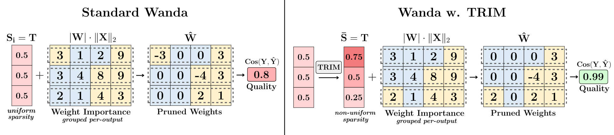

# TRIM: Targeted Row-wise Iterative Metric-driven Pruning
This repository contains code for pruning Large Language Models (LLMs) with unique *dimensionwise sparsity ratios* as presented in our [📖 Paper](https://arxiv.org/pdf/2505.16743). 
TRIM applies *varying levels of pruning to each row of a weight matrix* through a metric-driven iterative optimization process.  
We currently support naive integration of Wanda and Magnitude importance scores, as well as OWL, and AlphaPruning for layerwise sparsity allocation.



 
## Usage
### Overview of the main arguments
- `--model`: Specify the model to use, e.g., 'facebook/opt-13b'.
- `--prune_method`: Choose the pruning method from options like 'wanda', 'wanda_owl', or 'wanda_alpha'.
- `--use_trim`: Enable TRIM for dimensionwise per-output sparsity calculation.
- `--sparsity_ratio`: Set the sparsity level as a float between 0 and 1.
- `--task`: Define the task, options include 'None', 'wikitext', 'both' (this means wikitext + BoolQ), or 'all' (wikitext + all seven 0-shot tasks).
- `--nsamples_calibration`: Number of samples for calibration, default is 256.
- `--device`: Specify the device for computation, default is 'cuda'. If 'cpu', the model gets offloaded to CPU memory but a CUDA device will still be used for inferencing each layer. 
---
- `--qmetric`: Select the TRIM layer quality metric, default is 'cosim_flat'.
- `--qmetric_dimwise`: Select the TRIM dimensionwise quality metric, default is 'cosim'.
- `--forbid_neg_lr`: Prevent TRIM from using negative learning rates if passed.
- `--input_recalc`: Recalculate input vectors for out-proj and MLP projections if passed.
---
### Example scripts

The following script prunes the Qwen2.5-3B model with TRIM and Wanda scores to 70% sparsity and evaluates perplexity on the wikitext dataset. 
For layerwise sparsity allocation [OWL](https://github.com/luuyin/OWL) will be used and the resulting layer ratios will be saved for future reuse.
```sh
python main.py  --model Qwen/Qwen2.5-3B \
                --prune_method wanda_owl \
                --use_trim \
                --sparsity_ratio 0.7 \
                --task wikitext \
                --device cuda \
                --Lamda 0.12 \
                --Hyper_m 5.0 \
                --save_layer_ratio # save OWL ratios
```

The following script prunes the Qwen2.5-72B model with TRIM and Wanda scores to 70% sparsity.
For layerwise sparsity allocation  [AlphaPruning](https://github.com/haiquanlu/AlphaPruning) will be used. 
The model will be offloaded to CPU memory and the resulting binary pruning masks will be stored in 'save_maks'.
```sh
python main.py  --model Qwen/Qwen2.5-72B \
                --prune_method wanda_alpha \
                --use_trim \
                --sparsity_ratio 0.7 \
                --task None \
                --device cpu \ # offload model to cpu memory
                --save_masks /mnt/... \ # save pruning masks
                --epsilon 0.1
```

## Setup

1. To get started quickly, you can either create a new environment or use an existing one. The following software versions have been tested and are recommended:
- Python 3.9
- PyTorch 2.5.1
- CUDA 12.2
- Transformers 4.48.1
- NumPy 1.26.4

2. Update the default cache directory in `main.py` to the location where your models are stored.

## Repository Structure
- `main.py` 
- `lib/`
  - `prune.py` # Contains all available pruning functions
  - `trim.py` # Contains code for calculating row-wise sparsity ratios
  - `...` # Other modules and utilities
- `scripts/` # For scripts and jobs to run
- `OWL/` # Directory to save previously calculated OWL layer sparsities
- `AlphaPruning/` # Directory to calculate and save AlphaPruning layer statistics

## Notes
The implementation of the code is mainly built upon the [Wanda](https://github.com/locuslab/wanda) repository. Notable changes include:
- Code now supports CPU offloading. This means the model can be loaded to CPU memory and only the layer that gets pruned in the current iteration resides on the GPU.
This allows pruning of models where the model naively wouldn't fit into GPU memory. E.g. Qwen2.5-72B in FP16 can be pruned on one A100 40GB and 256GB memory.
- Inference loop uses position_embeddings and not position_ids for package compatibility. Change if necessary. 
- The pruning scripts for both OPT and non-OPT models have been unified into one.

## Citation
**TRIM: Achieving Extreme Sparsity with Targeted Row-wise Iterative Metric-driven Pruning**  [](https://arxiv.org/pdf/2505.16743)   </br>
*Florentin Beck¹, William Rudman², Carsten Eickhoff¹'²*  <br>
University of Tübingen¹, Brown University²   <br>
```bibtex
@misc{beck2025trimachievingextremesparsity,
      title={TRIM: Achieving Extreme Sparsity with Targeted Row-wise Iterative Metric-driven Pruning}, 
      author={Florentin Beck and William Rudman and Carsten Eickhoff},
      year={2025},
      eprint={2505.16743},
      archivePrefix={arXiv},
      primaryClass={cs.CL},
      url={https://arxiv.org/abs/2505.16743}, 
}
```

## Acknowledgements
This code is based on the [SparseGPT](https://github.com/IST-DASLab/sparsegpt), [Wanda](https://github.com/locuslab/wanda), [OWL](https://github.com/luuyin/OWL) and [AlphaPruning](https://github.com/haiquanlu/AlphaPruning) repositories.
